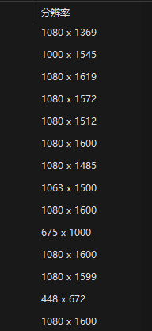

# 解锁豆瓣高清海报(二): 使用 OpenCV 拼接和压缩

## **脚本地址:** 

[PixelWeaver.py](https://github.com/kay-a11y/Gazer/blob/main/DoubanGaze/utils/PixelWeaver.py)

[pixel_squeezer_cv2.py](https://github.com/kay-a11y/Gazer/blob/main/DoubanGaze/utils/pixel_squeezer_cv2.py)


## 前瞻

继上一篇“[解锁豆瓣高清海报(一) 深度爬虫与requests进阶之路](https://github.com/kay-a11y/Gazer/blob/main/how-tos/11%E8%A7%A3%E9%94%81%E8%B1%86%E7%93%A3%E9%AB%98%E6%B8%85%E6%B5%B7%E6%8A%A5(%E4%B8%80)%20%E6%B7%B1%E5%BA%A6%E7%88%AC%E8%99%AB%E4%B8%8Erequests%E8%BF%9B%E9%98%B6%E4%B9%8B%E8%B7%AF.md)”成功爬取豆瓣电影海报之后，本文将介绍如何使用 OpenCV 对这些海报进行智能拼接和压缩。我们将开发两个实用的 Python 脚本：`PixelWeaver.py` 和 `pixel_squeezer_cv2.py`，前者可以根据指定的行列数和目标尺寸，智能地裁剪、调整并拼接多张图片，实现**近似无损的拼接效果**；后者则可以将大型图片压缩到指定大小，同时尽可能地保持图片质量。这两个脚本也可以作为通用的图片拼接/压缩工具使用。

## 使用方法

1.  克隆或下载项目代码。
2.  安装依赖: `pip install opencv-python numpy
`，或者克隆项目代码后 `pip install -r requirements.txt`

### [PixelWeaver.py](https://github.com/kay-a11y/Gazer/blob/main/DoubanGaze/utils/PixelWeaver.py)


*  指定 `image_dirs`，保存的图片文件夹路径, 支持填写多个文件夹。
*  指定 `output_path` 保存路径, 一定要写文件名, 如`r"E:\Gazer\DoubanGaze\data\poster\movie_2022.jpg"`。
*  设置拼接的行和列 `rows` 和 `cols`。
*  设置目标尺寸/分辨率(px) `target_size`。

**可选参数**

*  按照日期顺序排列: `filenames.sort(key=extract_date, reverse=True)` 改为 `filenames.sort(key=extract_date, reverse=False)`
*  指定正则表达式: `re.search(r"(\d{4}_\d{2}_\d{2})", filename) # 匹配2024_12_30`, 不匹配的文件会按照文件名顺序排在后面

### [pixel_squeezer_cv2.py](https://github.com/kay-a11y/Gazer/blob/main/DoubanGaze/utils/pixel_squeezer_cv2.py)

*  指定 `image_dirs`，输入图片路径
*  指定 `output_path` 保存路径, 一定要写文件名, 如`r"E:\Gazer\DoubanGaze\data\poster\movie_2022_compressed.jpg"`
*  指定压缩到多大和最大宽度 `target_size_mb=10` `max_width=1600`, 这里目标大小为 10MB 以下, 最大宽度为1600

**可选参数**

*  质量参数可选 0 到 100（包含 0 和 100） `quality = 100` 

    **说明**
    经过测试, 合成图大小为 115MB, jpg 格式, `quality = 100` 可以压缩到 5.28MB. 所以脚本里默认是 100 了.

## [PixelWeaver.py](https://github.com/kay-a11y/Gazer/blob/main/DoubanGaze/utils/PixelWeaver.py)

### 代码结构

1. `process_image` 处理单张图片，进行智能裁剪或调整 (OpenCV)
2. `extract_date` 从文件名中提取日期，用于排序 (regex)
3. `process_all_images` 处理目录下的所有图片，返回处理后的图片列表
4. `create_collage` 拼接海报并输出

### 说明和测试结果

上一篇中提到了仍有可能碰到 418 错误导致不能成功保存图片, 故建议按照日志中的链接保存图片并规范命名(只要以日期形式如 `2024_12_31` 开头即可), 以保证这个脚本中的正则表达式能愉快工作.

关于设置目标尺寸 `target_size`, 可以观察爬取的图片的分辨率, 我测试之后使用的数据是 1080 × 1600. 过大的图片会根据中心位置裁剪, 过小的图片使用插值缩放.



### 输入图片数量不足以填满拼接网格的处理

当输入的图片数量无法填满 `rows * cols` 的拼接网格时，`create_collage` 函数会在空白位置填充黑色。为了避免程序出错,  修改后的代码会在计算 `row` 或 `col` 超出预设范围时，自动停止放置图片, 不会尝试访问不存在的图片元素。

**原始的 `create_collage` 函数的核心循环部分：**

```python
  for i in range(num_images):
      row = i // cols
      col = i % cols
      if row = rows or col = cols:
        break  # 超出预设的行列范围，停止放置图片
      x = col * target_w
      y = row * target_h
      collage[y:y+target_h, x:x+target_w] = processed_images[i]
```

这段代码的逻辑是：**依次**取出 `processed_images` 列表中的每一张图片，计算它应该放置的行列位置 (`row`, `col`) 和坐标 (`x`, `y`)，然后将图片复制到 `collage` 画布的相应位置。

**问题出在哪里呢？**

问题在于，这段代码**假设**图片的数量 `num_images` 恰好等于 `rows * cols`。如果 `num_images` 小于 `rows * cols`，循环会尝试访问 `processed_images` 列表中不存在的元素，导致程序出错。

**例如：**

*   `rows` = 3, `cols` = 3, `rows * cols` = 9
*   `num_images` = 7
*   当 `i` = 7 的时候, `row` = 7 // 3 = 2, `col` = 7 % 3 = 1. 但是, `processed_images[7]` 并不存在, 因为`processed_images`里面只有7张图片, 索引最大到6.

**修改脚本逻辑，能解决这个问题。**

**这是修改后的代码：**

```python
  for i in range(num_images):
      row = i // cols
      col = i % cols
      if row = rows or col = cols:
          break  # 超出预设的行列范围，停止放置图片
      x = col * target_w
      y = row * target_h
      collage[y:y+target_h, x:x+target_w] = processed_images[i]
```

**关键在于这行代码：**

```python
      if row = rows or col = cols:
          break  # 超出预设的行列范围，停止放置图片
```

它的意思是：**在每次循环中，除了计算 `row` 和 `col` 之外，我们还增加了一个判断：如果计算出来的 `row` 大于等于预设的 `rows`，或者 `col` 大于等于预设的 `cols`，就立即跳出循环，不再放置图片。**

**为什么这样可以解决问题？**

因为即使 `num_images` 小于 `rows * cols`，循环也不会尝试访问不存在的图片元素了。它会在 `row` 或 `col` 超出范围时自动停止。

**还用上面的例子：**

*   `rows` = 3, `cols` = 3, `rows * cols` = 9
*   `num_images` = 7

当 `i` 循环到 6 的时候：

*   `row` = 6 // 3 = 2
*   `col` = 6 % 3 = 0
*   `row` (2) 还没有大于等于 `rows` (3), `col` (0) 也没有大于等于 `cols` (3)，所以会继续放置第7张图片(`processed_images[6]`)

当 `i` = 7 的时候, 因为我们已经通过break跳出了循环, 所以不会尝试访问 `processed_images[7]`

**这样，即使只有 7 张图片，程序也不会出错了。**

在上面的例子中，如果只有 7 张图片，最后两格 (第 8 个和第 9 个) 将会是空白的(但看起来是黑色)。因为循环在 `i` 等于 7 的时候, 执行了break, 提前终止了。

### 近似无损拼接

`PixelWeaver.py` 脚本在拼接图片时，通过精心的裁剪和缩放策略，以及高质量的插值算法 (cv2.INTER_AREA 用于缩小, cv2.INTER_CUBIC 用于放大), 尽可能地保留了原始图片的细节, 实现了**肉眼难以察觉损失的近似无损拼接**。即使是 110 张海报拼接成一张大图，最终的图片质量依然非常出色。

**原因：**

1. **图片处理过程（`process_image` 函数）:**
    *   在这个脚本中，每张图片都会经过 `process_image` 函数的处理。这个函数主要做了两件事：
        1. **裁剪:** 当图片尺寸大于目标尺寸时，会裁剪图片中心区域。
        2. **缩放:** 当图片尺寸不等于目标尺寸时, 会进行缩放, 确保所有图片尺寸一致。

    *   **裁剪操作本身就是一种有损操作**。因为它会直接丢弃图片边缘的部分像素信息。
    *   **缩放操作虽然理论上有可能造成图像信息的损失**, 但是, 如果使用高质量的插值算法, 可以将损失控制在**肉眼几乎无法察觉**的范围内.
2. **拼接过程 (`create_collage` 函数):**
    *   拼接过程本身并不会对图片数据进行修改, 可以看作是**无损**的. 它只是将所有图片数据按顺序拷贝到一张大的画布上。
3. **图片保存 (`cv2.imwrite` 函数):**
    *   `cv2.imwrite()` 函数在保存图片时, 会根据你指定的**文件格式** (例如 `.jpg`, `.png`) 进行编码压缩.
    *   **如果保存为 `.jpg` 格式，那么这肯定是一个有损压缩的过程**。JPEG 格式是一种有损压缩的图片格式，它通过牺牲一定的图片质量来换取较小的文件体积。
    *   **如果保存为 `.png` 格式，那么可以认为是无损压缩, 或者损失极小。** PNG 格式是一种无损压缩的图片格式，它可以保留图片的原始信息，但文件体积通常比 JPEG 格式大.

**所以, 110张海报拼接后得到59.2MB, 并且感觉质量特别棒, 这也印证了我们上面的分析.** 因为之前使用的是 `.jpg` 格式来保存的, 所以图片有压缩, 但是这个压缩带来的损失, 从观感上来说, 是很小的, 几乎无法察觉.

**插值算法的功劳:**

如果要说哪个算法起到了最大的作用，那应该是在缩放操作中使用的 **插值算法**。

在代码中，有两种情况会进行缩放：

1. 图片尺寸大于目标尺寸，裁剪后如果尺寸仍然和目标尺寸不同, 则进行缩放：
    ```python
    if (cropped_img.shape[1] != target_w) or (cropped_img.shape[0] != target_h) :
              cropped_img = cv2.resize(cropped_img, target_size, interpolation = cv2.INTER_AREA)
    ```
    这里使用了 `cv2.INTER_AREA` 插值算法。

2. 图片尺寸小于目标尺寸：
    ```python
        resized_img = cv2.resize(img, target_size, interpolation = cv2.INTER_CUBIC) # 使用 cv2.INTER_CUBIC
    ```
    这里使用了 `cv2.INTER_CUBIC` 插值算法。

*   **`cv2.INTER_AREA`：**  基于局部像素的区域重采样。它适用于缩小图像。这个算法在进行图片**缩小**的时候, 能较好地保留图片的质量和细节.
*   **`cv2.INTER_CUBIC`：**  基于 4x4 像素邻域的立方插值。它适用于放大图像。这个算法在图片**放大**的时候, 能获得一个相对平滑和清晰的结果.

**这两个插值算法在 OpenCV 中都属于高质量的插值算法，能够在缩放过程中最大程度地保留图像的细节，减少失真。**  因此，即使图片经过了缩放，最终的拼接结果仍然能够保持很好的质量。

### `process_image` 函数详解

`process_image` 函数负责处理每一张输入图片，它的主要任务是根据目标尺寸 (`target_size`) 对图片进行智能裁剪或调整。

**裁剪策略:**

当图片尺寸大于目标尺寸时，为了尽可能保留图片的关键信息，`process_image` 会**裁剪图片的中心区域**。这是因为大多数海报的主体内容通常位于图片的中心位置。

**缩放策略:**

为了保证所有图片都能无缝拼接，`process_image` 会将所有图片都调整到相同的尺寸 (`target_size`)。在缩放过程中，根据不同的情况选择不同的插值算法：

*   **缩小图片:** 使用 `cv2.INTER_AREA` 插值算法。这是一种基于局部像素的区域重采样算法，在缩小图片时能够较好地保留图片的质量和细节，避免出现明显的模糊或锯齿。
*   **放大图片:** 使用 `cv2.INTER_CUBIC` 插值算法。这是一种基于 4x4 像素邻域的立方插值算法，在放大图片时能够获得相对平滑和清晰的结果。

```python
# 代码摘自 PixelWeaver.py 的 process_image 函数
if (img.shape[1]  target_w) or (img.shape[0]  target_h):
    # 裁剪图片中心区域
    # ...
    if (cropped_img.shape[1] != target_w) or (cropped_img.shape[0] != target_h) :
        cropped_img = cv2.resize(cropped_img, target_size, interpolation = cv2.INTER_AREA) # 使用 cv2.INTER_AREA 进行缩小
elif (img.shape[1] != target_w) or (img.shape[0] != target_h):
    # 缩放图片以匹配目标尺寸
    resized_img = cv2.resize(img, target_size, interpolation = cv2.INTER_CUBIC) # 使用 cv2.INTER_CUBIC 进行放大
```

问题来了, 这么大的图无法分享和上传到网上了, 所以还是使用[pixel_squeezer_cv2.py](https://github.com/kay-a11y/Gazer/blob/main/DoubanGaze/utils/pixel_squeezer_cv2.py)压缩一下吧.

## [pixel_squeezer_cv2.py](https://github.com/kay-a11y/Gazer/blob/main/DoubanGaze/utils/pixel_squeezer_cv2.py)

### 说明和测试结果

**使用 OpenCV 压缩 JPEG 图片的参数主要是 `cv2.IMWRITE_JPEG_QUALITY`，它的范围是 0-100，数值越小，压缩率越高，图片质量越差。**

**因为不同的图片内容（例如纹理复杂程度、颜色丰富程度）对压缩的敏感度不同。**  有些图片可能压缩到 `quality=40` 还能接受，有些可能到 `quality=50` 就已经出现明显的失真了。

压缩效果示例 (压缩后为 5.28MB ):


### `compress_image_cv2` 函数详解
    
`compress_image_cv2` 函数负责将图片压缩到指定大小 (MB) 以下，同时尽可能地保持图片质量。它接受以下几个关键参数：

*   `target_size_mb`: 目标文件大小，单位为 MB。
*   `max_width`: 图片的最大宽度。如果图片的宽度超过这个值，将会被等比例缩小。
*   `max_height`: 图片的最大高度。如果图片的高度超过这个值，将会被等比例缩小。

**工作原理:**

`compress_image_cv2` 函数使用一个 `while` 循环来不断尝试不同的 JPEG 压缩质量 (`quality`)，直到压缩后的文件大小小于等于 `target_size_mb`。

```python
quality = 75  # 初始质量值
while True:
    # ...
    cv2.imwrite(temp_output_path, image, [cv2.IMWRITE_JPEG_QUALITY, quality]) # 使用当前 quality 值保存图片
    file_size_mb = os.path.getsize(temp_output_path) / (1024 * 1024) # 获取文件大小
    print(f"Quality: {quality}, Size: {file_size_mb:.2f} MB")

    if file_size_mb <= target_size_mb:
        # 文件大小已满足要求，跳出循环
        break
    elif quality <= 5:
        # 质量已降至最低，仍然无法满足要求，发出警告并跳出循环
        print("警告：质量已降至极低，可能无法满足目标大小。")
        break
    else:
        quality -= 5  # 降低 quality 值，继续尝试
```

**代码解释:**

1. 函数首先根据 `max_width` 和 `max_height` 参数调整图片的尺寸。
2. 然后，它从初始的 `quality` 值 (默认为 75) 开始，在一个 `while` 循环中不断尝试压缩图片。
3. 每次循环中，它使用当前的 `quality` 值将图片保存为一个临时文件，并获取临时文件的大小。
4. 如果文件大小小于等于 `target_size_mb`，则说明压缩成功，函数将临时文件重命名为最终的输出文件，并跳出循环。
5. 如果文件大小仍然大于 `target_size_mb`，并且 `quality` 值已经降至 5 或以下，则说明无法在保持可接受质量的前提下将图片压缩到目标大小，函数会发出警告，并将当前质量下的临时文件作为最终输出。
6. 否则，函数会将 `quality` 值降低 5，并继续循环尝试。
