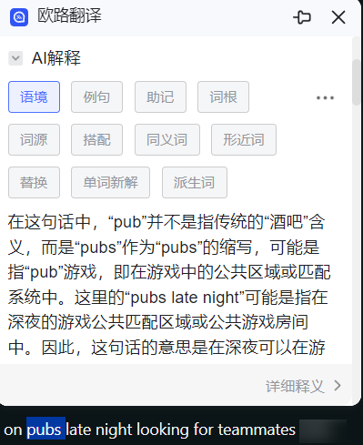
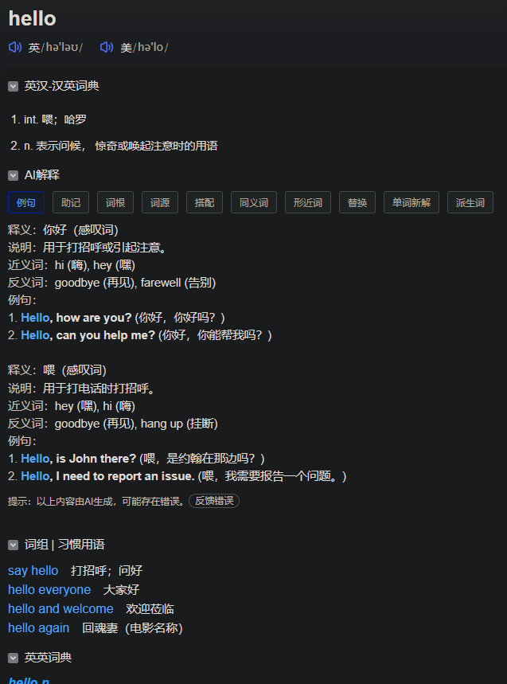
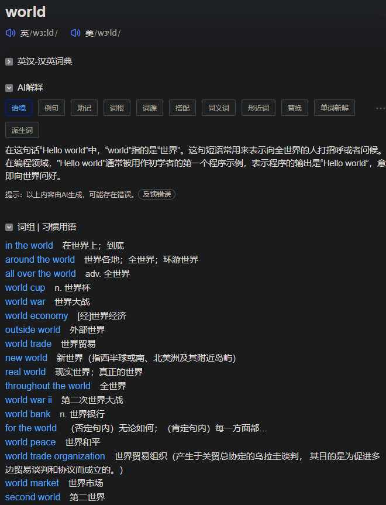
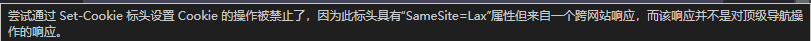

# 逆向工程(三) 欧陆词典翻译插件的请求模拟/语境翻译 API 获取

## 前言

本次逆向源于对欧路词典 AI 翻译功能的好奇。
接下来将详细记录我如何**通过开发者工具模拟请求调用欧路词典的翻译工具**, 尤其是*语境翻译* 功能。

## 环境

*   Python 3
*   欧路词典翻译插件

## 顺着网线

### 分析

首先打开任意英文网页, 划词翻译一个单词, 插件会默认跳出语境翻译。


打开开发者工具, 筛选条件为 `method:GET eudic`, 找到名为 `MiniDictSearch2?..` 的一条请求, 验证一下载荷:

```
word: pubs
context: I’m usually on pubs late night looking for teammates
```

因为这是一条 GET 请求, 我们直接复制请求网址试试能不能发现什么
`https://dict.eudic.net/dicts/MiniDictSearch2?word=pubs&context=I%E2%80%99m%20usually%20on%20pubs%20late%20night%20looking%20for%20teammates`

显然第一眼观察到这个网址就知道, 它的查询单词和上下文文本都是明文写在 URL 里的, 包含了完整的上下文语句。

**这个 URL 主要包含两个参数：**

*   `word=pubs`: 要查询的单词。
*   `context=...`: 选中的上下文语句，使用 URL 编码（观察更多可以总结: `%20` 代表空格，`%2C` 代表逗号, `%E2%80%99` 代表 `’`）。

**这个发现意味着什么呢？**

1. **欧路词典的服务器是直接接收明文的上下文语句的** 这可能为我们理解它的提示词策略提供了更直接的线索！
2. **可以尝试修改这个 URL 中的参数** 例如，我们可以修改 `pubs` 参数来查询不同的单词，或者修改 `context` 参数来测试不同的上下文语句，看看 AI 翻译的结果会如何变化。
3. **我们可以用 Python 脚本来构造和发送这些请求** 我们可以使用 `requests` 库来发送 HTTP 请求，并解析返回的结果。这样我们就可以自动化地进行大量的测试，并分析 AI 翻译的规律。

### 行动

我将 `pubs` 改成这个上下文中任一单词, 其他不变, 构造网址, 依然可以成功获取翻译信息。确认了请求 URL 的构造. 只要 word 后面添加任意单词: `https://dict.eudic.net/dicts/MiniDictSearch2?word=hello` 就是相当于在网页上查找单词, 但是并不是常规的用户搜索界面。而是像下面这种。


如果 `https://dict.eudic.net/dicts/MiniDictSearch2?word=world&context=Hello%20world` 后面加上上下文, 就会在 AI 解释那边自动默认显示语境翻译


另外, 有两个地方可以找到**最关键的请求接口**: `https://dict.eudic.net/dicts/AiExplainTabStream`

1. 依然在刚才的开发者工具页面, 过滤 `ai/method:POST`。
2. 在 `https://dict.eudic.net/dicts/MiniDictSearch2?word=pubs&context=I%E2%80%99m%20usually%20on%20pubs%20late%20night%20looking%20for%20teammates` 网页中, 按 F12, 同 1 的过滤条件也可以发现这个接口。

显然这个应该是导向欧路词典内部的 AI 语境翻译的源头接口。这个接口就不能直接网页转到, HTTP 错误码 500。

### **初步分析**

1. **不同的接口，不同的功能：**

    *   `https://dict.eudic.net/dicts/MiniDictSearch2` 看起来更像是一个“通用”的单词查询接口，当只提供 `word` 参数时，它会返回一个标准的单词释义页面（就像截图中的那样）。
    *   而当同时提供 `word` 和 `context` 参数时，`MiniDictSearch2` 接口的结果中会包含 AI 解释，并且默认显示“语境”翻译。
    *   `https://dict.eudic.net/dicts/AiExplainTabStream` 则更像是专门负责“AI 语境翻译”的接口。
2. **`AiExplainTabStream` 接口的特点：**

    *   它是一个 POST 请求，这与 `MiniDictSearch2` 的 GET 请求不同。
    *   它返回的数据类型是 `text/event-stream`，这是一种用于服务器发送更新到客户端的流数据格式，通常用于实时应用，例如聊天、股票行情等。这说明欧路词典的 AI 语境翻译可能是以流的形式逐步生成的。
3. **关于 `MiniDictSearch2` 接口的更多发现：**

    *   **只能支持一个单词/字母：** `MiniDictSearch2` 接口在用于语境翻译时，只能支持一个单词或字母。
    *   **不会识别字母来源：** 当从一个单词中拆出一个字母进行查询时，它不会识别出你是从哪里挑出的字母，这说明这个接口在处理字母查询时，可能没有使用上下文信息。
    *   **`MiniDictSearch2` 集合了多种查询功能：** `MiniDictSearch2` 接口集合了单词查询、语境翻译、例句查询等多种功能，说明它是一个“多功能”的接口。
    *   **源头的 AI 语境翻译接口是 `AiExplainTabStream`:** 两个接口的语境翻译内容相同，推测 `AiExplainTabStream` 是源头的 AI 语境翻译接口.

**基于以上分析，我们可以推测：**

*   欧路词典的 AI 翻译功能可能由多个不同的接口协同完成。
*   `MiniDictSearch2` 负责处理通用的单词查询和初步的翻译结果。
*   `AiExplainTabStream` 负责生成更复杂的 AI 语境翻译，并且可能是以流的形式逐步返回结果。

**接下来，我们可以尝试以下几个方向：**

1. **分析 `AiExplainTabStream` 的请求参数：** 我们需要仔细分析 `AiExplainTabStream` 的 POST 请求中都包含了哪些参数，例如除了 `word` 和 `context` 之外，是否还有其他的参数？这些参数是如何生成的？

    *   利用浏览器开发者工具，查看当我们触发 AI 语境翻译时，`AiExplainTabStream` 请求的详细信息，包括请求头、请求体等等。
2. **尝试构造 `AiExplainTabStream` 请求：** 虽然我们无法直接访问这个接口，但是我们可以尝试根据我们分析出的请求参数，使用 Python 的 `requests` 库来构造和发送 POST 请求，看看能否得到响应。

    *   需要模拟浏览器的请求头，或者提供一些认证信息，需要进一步分析。
3. **继续探索 `MiniDictSearch2` 接口：** 尝试更多不同的 `word` 和 `context` 组合，看看 `MiniDictSearch2` 接口的返回结果有什么变化，以及何时会触发 `AiExplainTabStream` 接口的调用。

**1. `AiExplainTabStream` 的载荷 (Payload):**

```txt
status: xxx
tag: #语境
```

*   **`status`:** 经过多次测试(长文本和短文本), 这个参数是一个经过编码后的字符串，包含了查询的单词, 上下文.`QYNK0FIc0FJZy1sYW5nK0FDSS06K0FDSS1lbitBQ0ktLCtBQ0ktd29yZCtBQ0ktOitBQ0ktT3JlZ29uK0FDSS0sK0FDSS1jb250ZXh0K0FDSS06K0FDSS1`这一段应该是固定字符, 后面加上被 base64 加密的 `word` 和 `context`。可惜的是, `context` 加密前还被加上了 `K+IC` 等字符, 暂时还不能解密出原文, 还需要更多的信息进行测试。
*   **`tag`:** `#语境`，这个**明文**指出当前请求的是“语境”翻译。不同的标签对应不同的提示词或请求参数。

**接下来**

1. **解码 `status` 参数:** 尝试更多的输入样本, 也许能看出规律。把加密前的 `context` 提取出来
2. **分析 `Cookie`:** 看看 `Cookie` 中是否包含了用户认证信息，或者其他的关键信息。
3. **尝试构造 `AiExplainTabStream` 请求:** 我们可以尝试修改 `tag` 参数，看看能否获取到其他标签（例如“例句”、“词根”等）下的 AI 翻译结果。

#### `status` 参数的 base64 编码

*   **识别 Base64 编码:** Base64 编码的字符串通常包含大写字母、小写字母、数字以及 `+` 和 `/` 两个符号，并且长度通常是 4 的倍数。`status` 参数看起来就很符合 Base64 编码的特征。

#### **1. `context` 加密前的处理:**

*   把网址改成 `https://dict.eudic.net/dicts/MiniDictSearch2?word=Hi&context=Hi%20just%20desperatel` 后，`AiExplainTabStream` 的 `status` 参数变成了 `xxx`。
*   而之前的 `status` 参数(在使用了明显更长的上下文的情况下)是 `xxx`。
*   对比这两个 `status` 的值，我们可以发现它们的前缀 `QYNK0FIc0FJZy1sYW5nK0FDSS06K0FDSS1lbitBQ0ktLCtBQ0ktd29yZCtBQ0ktOitBQ0kt` 是相同的, 我们可以推断出, 这一段前缀是表达了其他参数。而其后的部分，一个是 `aGkrQUNJLSwrQUNJLWNvbnRleHQrQUNJLTorQUNJLUhpIGp1c3QgZGVzcGVyYXRlbCtBQ0kt` (查询 Hi, context 是 Hi just desperatel), 另一个是`xxx`(查询 Oregon, context 是 Hi just desperately in need of good teammates...)。
*   很明显这个 `status` 是 base64 编码, 其中 `aGkrQUNJLSwrQUNJLWNvbnRleHQrQUNJLTorQUNJLUhpIGp1c3QgZGVzcGVyYXRlbCtBQ0kt` 解码后是 `hi+ACI-,+ACI-context+ACI-:+ACI-Hi just desperatel+ACI-`, 也就是说, `word` 后面被加上了 `+ACI-`。
*   而 `LUhpIGp1c3QgZGVzcGVyYXRlbCtBQ0kt` 解码后是 `-Hi just desperatel+ACI-`, 也就是说, `context` 前面被加上了 `-`, 后面被加上了 `+ACI-`。
*   综合来看, `word` 和 `context` 都会被加上 `+ACI-`, 并且 `context` 最前面还会加上 `-`。
*   由于 `-` 不符合 base64 编码规范, 所以才需要 urlencode 成 `%2D`。

简单点说(这里我又换了一个例子), 关键的 `d29ybGQrQUNJLSwrQUNJLWNvbnRleHQrQUNJLTorQUNJLUhlbGxvIHdvcmxkK0FDSS0` 编码, 解码后是 `world+ACI-,+ACI-context+ACI-:+ACI-Hello world+ACI-`。

#### **2. `tag` 的变化:**

*   当点击“例句”时，`tag` 的值变成了 `#例句`，这进一步验证了 `tag` 参数是用来区分不同功能的。

#### **3. `Cookie` 的分析:**

*   在两次不同的 `word` 和 `context` 测试中，`AiExplainTabStream` 请求的 `Cookie` 值是相同的，这说明这个 `Cookie` 可能与特定的查询无关，而是与用户会话 (session) 相关。
*   `MiniDictSearch2` 接口的响应头中有一个 `Set-Cookie` 字段，而没有 `Cookie` 字段，这说明 `MiniDictSearch2` 接口可能是用来设置 `Cookie` 的，而 `AiExplainTabStream` 接口则使用这个 `Cookie` 来进行身份验证或其他操作。
*   截图中提示了“尝试通过 Set-Cookie 标头设置 Cookie 的操作被禁止了，因为此标头具有“SameSite=Lax”属性但来自一个跨网站响应，而该响应并不是对顶级导航操作的响应。” 这句话说的是阻止跨站伪造请求, 保证安全性。
    

#### **综上，目前可以知道：**

*   `status` 参数的值是由 `word`, `context` 以及其他参数经过一系列的编码和组合操作生成的, 其中的 `word` 和 `context` 部分加密方法我们也推测出来了。
*   `tag` 参数用于区分不同的功能（例如语境、例句等）。
*   `Cookie` 用于用户会话管理，可能与身份验证或其他操作有关。

### **接下来：**

1. **重点: 解码 `status` 参数, 特别是解码出 `context` 部分:** 我们需要进一步研究这个参数是如何生成的, 才能破解它的加密方式。尝试更多的 `word` 和 `context` 组合，看看 `status` 的值会如何变化，尝试找出规律。
2. **分析 `Cookie` 的生成机制:** 需要弄清楚 `Cookie` 是如何生成的，以及它的具体作用。我们可以尝试在不同的浏览器或设备上访问欧路词典，看看 `Cookie` 的值是否相同。
3. **尝试修改 `tag` 参数:** 尝试修改 `AiExplainTabStream` 请求中的 `tag` 参数，看看能否获取到其他标签下的 AI 翻译结果。

#### **1. `tag` 的加密方式:**

请求网址最后部分的 `tag` 的值 `#语境` 和 `#例句` 并不是通过加密方式生成的，而是使用的 **URL 编码**。

*   **URL 编码:** URL 编码是一种将特殊字符（例如 #, 空格, 中文 等）转换成 `%` 加上两位十六进制数的方式，以便在 URL 中安全地传输。
*   **解码方式:** `#语境` 经过 URL 编码后变成了 `%23%E8%AF%AD%E5%A2%83`，其中 `%23` 对应 `#`，`%E8%AF%AD%E5%A2%83` 对应 `语境`。

#### **2. 为什么要阻止跨站伪造请求 (CSRF)？**

阻止 CSRF 是为了防止恶意网站诱导用户在不知情的情况下，在已登录的网站上执行非预期的操作。

*   **举例说明:** 假设你登录了你的银行网站，然后访问了一个恶意网站。这个恶意网站可能包含一个隐藏的表单，该表单会自动向你的银行网站提交一个转账请求。如果你没有防范措施, 你甚至不知道你进行了转账。
*   **欧路词典的防范措施:** 欧路词典使用 `SameSite=Lax` 的 `Cookie` 策略来防范 CSRF 攻击。`SameSite=Lax` 表示只有当用户从同一网站发起请求时，浏览器才会发送 `Cookie`。这样可以防止恶意网站伪造你的身份，向欧路词典发送请求。

#### **3. 使用 Python 构造请求尝试修改 `AiExplainTabStream` 请求中的 `tag` 参数**

*   最好的办法是使用 Python 的 `requests` 库来构造 POST 请求。这样就可以完全控制请求的各个部分，包括 `tag` 参数。

#### 示例脚本:

```python
import requests

url = "https://dict.eudic.net/dicts/AiExplainTabStream"
headers = {
    "User-Agent": "Mozilla/5.0 (Windows NT 10.0; Win64; x64) AppleWebKit/537.36 (KHTML, like Gecko) Chrome/114.0.0.0 Safari/537.36",
    "Content-Type": "application/x-www-form-urlencoded",
    "Cookie": "xxx"
}
data = {
    "status": "xxx",
    "tag": "#例句"  # 尝试修改 tag 参数
}

response = requests.post(url, headers=headers, data=data)

if response.status_code == 200:
    print(response.text.encode('raw_unicode_escape').decode('unicode_escape'))
else:
    print(f"请求失败，状态码：{response.status_code}")

```

#### **结果: 输出乱码**

使用 Python 的 `requests` 库构造 POST 请求，并修改 `tag` 参数后，输出出现乱码, 很可能是因为**编码问题**。

*   **编码不一致:** 欧路词典的服务器返回的数据可能使用了某种特定的编码方式（例如 UTF-8、GBK 等），而你的 Python 脚本在解码时没有使用相同的编码方式，导致了乱码。
*   **`requests` 库的默认编码:** `requests` 库在获取响应内容时，会尝试自动检测编码方式。但有时候它可能无法正确识别，导致解码错误。
*   **`text/event-stream` 的影响:** `AiExplainTabStream` 接口返回的数据类型是 `text/event-stream`，这是一种流数据格式。`requests` 库可能需要特殊的处理方式才能正确解析这种格式的数据。

#### **尝试解决**
*   **`encode('raw_unicode_escape').decode('unicode_escape')`:** 这种方法通常用于处理一些特殊的 Unicode 转义序列，但从结果来看，它并不适用于欧路词典返回的数据。这里用于处理服务器返回的响应内容中的 Unicode 转义序列。`raw_unicode_escape` 是一种特殊的编码方式，它会将 Unicode 转义序列（例如 `\u0041`）保留为原始的字节序列，而不是直接解码成对应的字符（例如 `A`）。
*   **`encode('gbk', errors='replace').decode('gbk', errors='replace')`:** 这种方法尝试使用 GBK 编码进行处理，并用 � (�) 替换无法识别的字符。结果出现了大量的 �，说明 GBK 编码也不完全匹配。
*   乱码中还是夹杂了 `world` 等英文, 说明可能不是简单的编码问题。

#### **为什么还是乱码？**

1. **更复杂的编码:** 欧路词典返回的数据可能使用了更复杂的编码方式，或者数据本身就存在一些特殊的格式。
2. **`text/event-stream` 的影响:** 正如之前提到的，`text/event-stream` 是一种流数据格式，`requests` 库可能无法直接按照普通文本的方式来处理它。
3. **加密或其他处理:** 不排除欧路词典对返回的数据进行了加密或其他处理的可能性。

#### **继续尝试：**

*   **直接以字节方式查看:** 不进行任何解码, 直接查看二进制字节。

    ```python
    if response.status_code == 200:
        print(response.content)
    ```

    看看输出的字节流中是否有可识别的模式，或者一些可读的字符。这有助于我们判断数据是否经过了加密或其他处理。

##### **结果**

**`response.content` 的分析：**

```
包含翻译结果的 JSON 数据
```

*   这是一个字节串 (byte string)，以 `b'` 开头。
*   其中夹杂着很多 `\x` 开头的十六进制表示的字符，这很可能是 **UTF-8 编码**。
*   我们可以尝试用 UTF-8 解码：

```python
byte_string = xxx'
decoded_string = byte_string.decode("utf-8")
print(decoded_string)
```

**解码成功！** 说明数据本身并没有经过加密，而是使用了 UTF-8 编码。故此, 我们只要把之前的代码改成这一行 `print(response.content.decode("utf-8"))` 就可以正确输出如下结果了

```
{"code":200,"message":"成功","data":{"result":"在这句话“Hello world”中，“world”指的是“世界”。这句短语常用来表示向全世界的人打招呼或者问候。在编程领域，\"Hello world\"通常被用作初学者的第一个程序示例，表示程序的输出是“Hello world”，意即向世界问好。"},"meta":{"balance":0}}
```

### **下一步计划：**

1. 我们可以编写一个 Python 函数来实现 `status` 参数的 base64 编码自动构建。参数是我们输入的 word 和 context, 选择语境, 例句, 助记, 词根, 词源, 搭配, 同义词, 形近词, 替换, 单词新解, 派生词(用数字 1-11 代替, 默认 1 也就是语境. 如果没有 context, 则没有语境选项, 默认为例句), 自动编码构成并返回 status, 然后我们就能放进 data 中.

*思考*: 显然在构造好头和尾之后, 我们只需要构造 `d29ybGQrQUNJLSwrQUNJLWNvbnRleHQrQUNJLTorQUNJLUhlbGxvIHdvcmxkK0FDSS0` 再拼接即可.
而这段 `d29ybGQrQUNJLSwrQUNJLWNvbnRleHQrQUNJLTorQUNJLUhlbGxvIHdvcmxkK0FDSS0` 用 base64 解码后是 `world+ACI-,+ACI-context+ACI-:+ACI-Hello world+ACI-`。那么我们如何由我们输入的 `word = "world", context = "Hello world"` 正确倒推并且保证完全符合呢?

2. 将原来的代码包装成函数.

## 后记
这篇博客虽然名为"API获取", 但实际上我们没有找到官方的 API 接口, 而是通过分析网页请求, 模拟了浏览器的行为来获取数据. 这其实是一种"请求模拟". 虽然这种方法可以获取到我们需要的信息, 但是它也存在一些局限性和风险, 例如:

* **不稳定:** 如果欧路词典修改了网页结构或接口实现，代码可能需要进行相应的修改。
* **有风险:** 这种行为可能违反欧路词典的使用条款，甚至可能引发法律风险。

所以, 本文代码依赖于欧路词典网页的结构和接口的实现方式, 这也意味着我们需要不断地观察和分析, 才能跟上欧路词典的更新.

## **免责声明：** 
本博客内容仅供技术研究和学习交流之用，不构成任何侵权行为。读者在使用博客中提到的方法和代码时，应遵守相关法律法规和网站的使用条款，并自行承担风险。作者不对任何因使用本博客内容而导致的后果负责。
